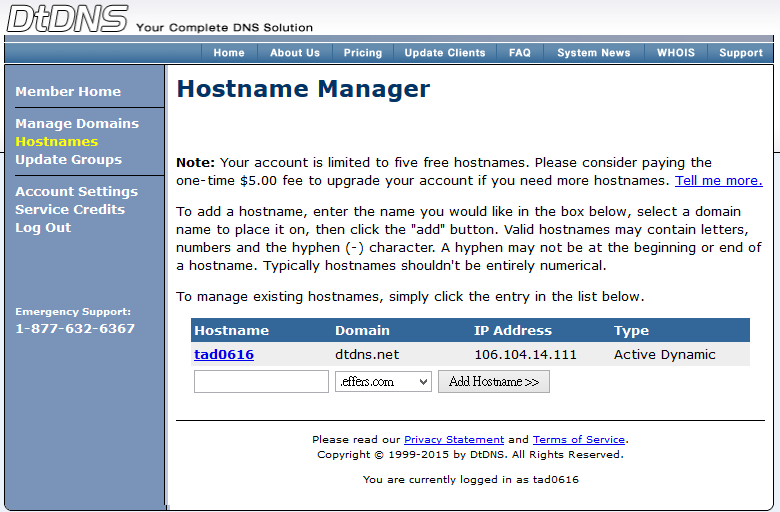
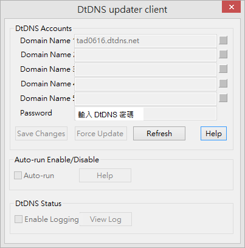
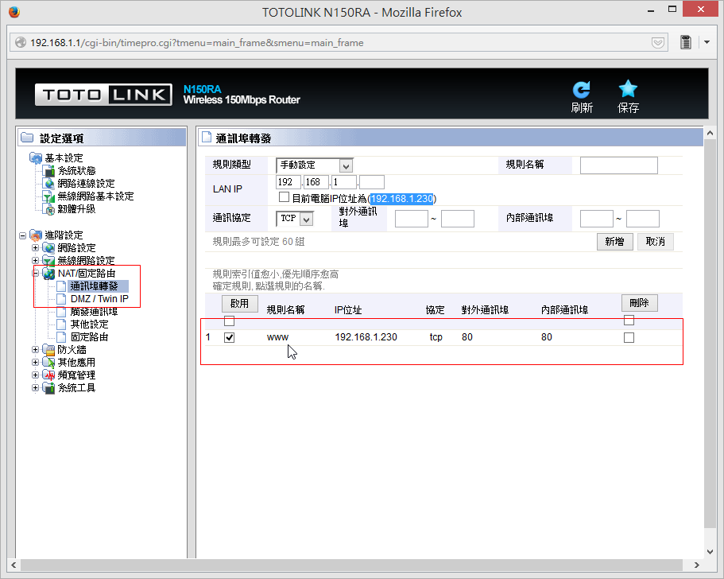
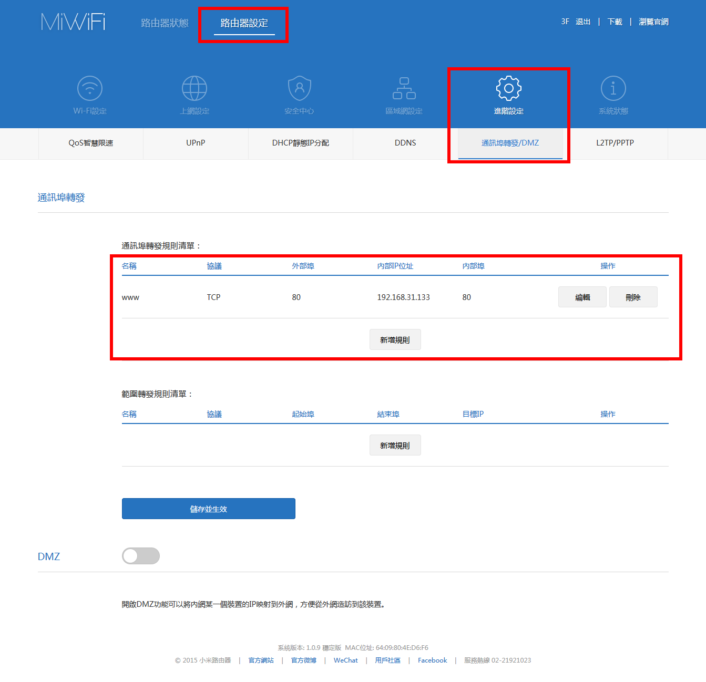

# 動態DNS設定

1. 先至 https://www.dtdns.com/ 註冊帳號
2. 至 Hostnames 註冊一個子網域  

3. 執行 Extra / DtDNS 填入子網域名稱，以及DtDNS密碼  

4. 儲存變更（Save Changes），靜候五分鐘至十分鐘

# 若是有經過一些路由器
1. 我家環境：對外是 106.104.14.111會連到2F的TOTO Link路由器，接著連到3F小米路由器又變成 192.168.1.230，從小米路由器連到桌機，桌機IP為192.168.31.133
2. 2F TOTO Link 路由器的「通訊埠轉發」設定：  

3. 3F小米路由器設定：設定192.168.31.133的80埠對應到內部80埠即可。  
