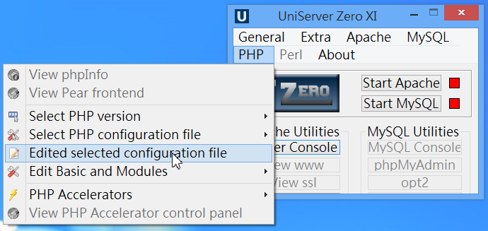
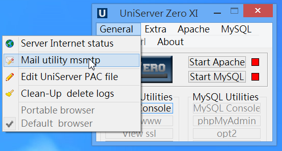
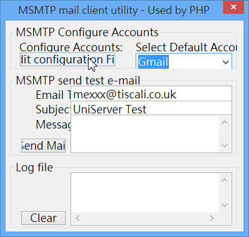
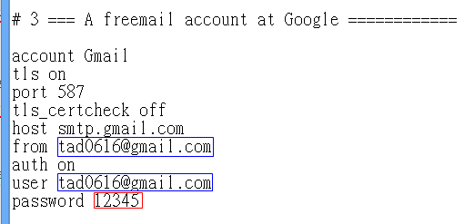

# 基本設定

基本上，安裝好無須設定什麼就能用了，但對於一些特別的需求，還是要設定一下會更好。

## 修改php.ini（重要）

請務必至少做以下兩個修改動作：
1. Uniform Server 預設使用的 php.ini 版本其實是 C:\UniServerZ\core\php54\php_production.ini，可直接開啟編輯之
2. 也可從控制台點選 PHP → Edited selected configuration file 來編輯之。

3. 找到 display_errors 並將值改成 On （若未改，PHP將無法顯示錯誤訊息，偵錯會很困難）
4. 找到 date.timezone 並將值改成 "Asia/Taipei" （若未改，系統時間將會差八小時）
5. 其餘設定，請視需求修改之。
6. 修改完，記得

## 讓 Uniform Server 可以寄信

如果沒有寄信需求，此步驟可略過
1. 先Stop Apache，接著點選 General→Mail utility msmtp

3. 按下左上角的 Edit configuration File 按鈕

4. 將裡面的Email修改成您的Gmail信箱（藍色框部份），密碼請設定成該信箱密碼。（紅色框部份）

5. 儲存後，可利用 2. 的那個界面來測試是否可以寄信。

### 6-3 修改網頁目錄位置

此步驟並非必須，但若您想將網頁目錄移至別的目錄下（例如移至 dropbox 中使之可以即時同步或備份），則可參考一下。

    設定檔位置：C:\UniServerZ\home\us_config\us_user.ini
    要轉移網頁目錄至其他位置（如： C:\Users\tad\Dropbox\www），請修改 US_ROOTF_WWW = C:/Users/tad/Dropbox/www
    DISPLAY_PAGE_2 可設成 no，如此就不會跳出 Uniform Server 的資訊頁視窗
    USER_EDITOR 可拿掉前面分號，並自行指定預設編輯器，例如：USER_EDITOR = C:/Users/tad/Dropbox/software/Sublime Text 3 x64/sublime_text.exe
    停止Apache、MySQL後，關閉 Uniform Server 控制台，然後再重開 Uniform Server 控制台，啟動 Apache 即可生效。

### 6-4 修改資料庫實體檔案位置

此步驟並非必須，但若您想將資料庫實體檔案目錄移至別的目錄下，則可參考一下。

    設定檔位置：C:\UniServerZ\home\us_config\us_config.ini
    要轉移MySQL的資料庫實體檔案位置（如： C:\Users\tad\Dropbox\sql），請在檔案最後新增一組[MYSQL]
    接著下一行寫入：datadir = C:\Users\tad\Dropbox\sql 即可
    停止Apache、MySQL後，關閉 Uniform Server 控制台，然後再重開 Uniform Server 控制台，啟動 MySQL 即可生效。
