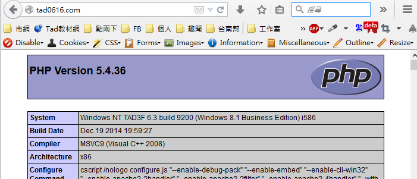

# 建立多網站虛擬主機

1. 建立 C:\UniServerZ\vhosts 資料夾
2. 執行 Apache / Apache Vhosts / Create Apache Vhost
3. 輸入相關設定，網址一樣隨便打

4. 啟動 Apache
5. 打開瀏覽器，輸入網址：

6. 愛建幾個網站，就建幾個網站，互不相關。
7. 若要調整虛擬主機的環境設定，請修改 C:\UniServerZ\core\apache2\conf\extra\httpd-vhosts.conf