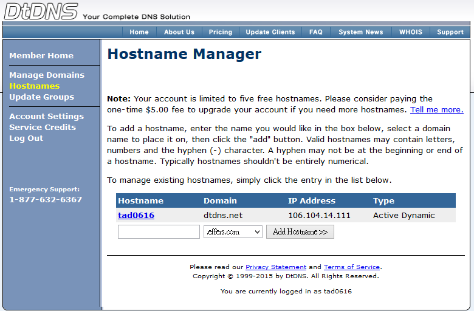
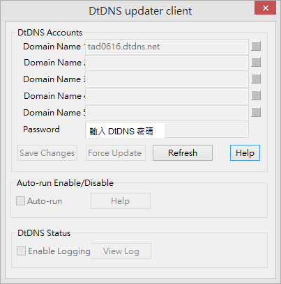
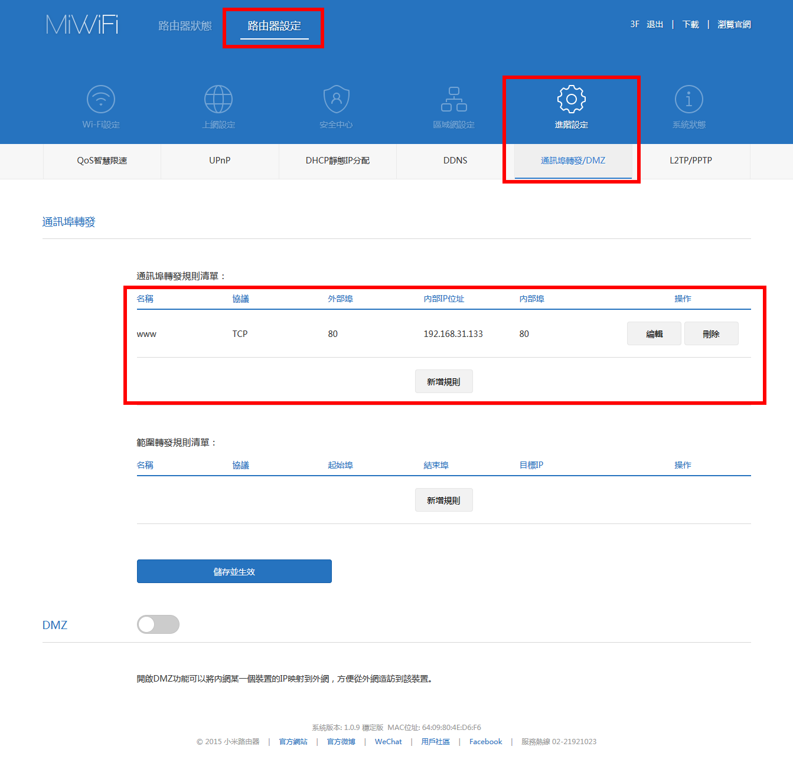

# proxy自動設定

1. 除非上網須經過proxy，否則應該用不到
2. 執行：General / Edit UniServer PAC file
3. 詳情請看：http://amon0626.pixnet.net/blog/post/26110279-pac-script%E6%95%99%E5%AD%B8

# 動態DNS設定

1. 先至 https://www.dtdns.com/ 註冊帳號
2. 至 Hostnames 註冊一個子網域

3. 執行 Extra / DtDNS 填入子網域名稱，以及DtDNS密碼

4. 儲存變更（Save Changes），靜候五分鐘至十分鐘

## 若是有經過一些路由器
1. 我家環境：對外是 106.104.14.111會連到2F的TOTO Link路由器，接著連到3F小米路由器又變成 192.168.1.230，從小米路由器連到桌機，桌機IP為192.168.31.133
2. 2F TOTO Link 路由器的「通訊埠轉發」設定：

3. 3F小米路由器設定：設定192.168.31.133的80埠對應到內部80埠即可。

# 開機自動啟動網站及資料庫

1. 以管理員身份開啟 UniController.exe
2. 執行 Extra / PC-Win strat-up
3. 全部打勾即可 

# 自動排程

1. 執行 Extra / Cron
2. 點選「Edit configuration file」參照範例設定欲自動執行時間
3. 勾選「Run Cron」
 
# 
