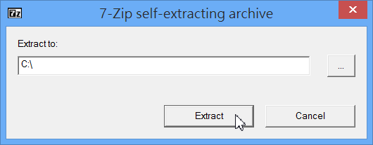
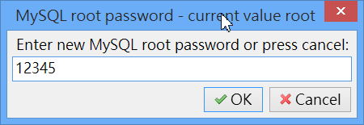

# UniForm Server 整合伺服器

官網：http://www.uniformserver.com/

本文範例以 Uniform Server ZeroXI 11.7.2 (27.8 MB ，2015/03/21釋出)為主

下載位置：http://sourceforge.net/projects/miniserver/files/latest/download?source=files

## 一、關於 Uniform Server ZeroXI

Uniform Server 是一套windows下整合Apache網站伺服器、PHP、MySQL資料庫的安裝軟體，安裝過程簡單，功能強大，體積卻很小，值得推薦使用。

## 二、Uniform Server 的版本

早期叫做 Uniform Server，後來全新大改版，架構全部重新設計，新系列名稱為 ZeroXI，特點是變成模組化，所有部份都可局部升級。

## 三、安裝

直接雙擊 11_7_3_ZeroXI.exe 即可安裝，該檔案是自解壓縮檔，所以，會解壓縮出一個資料夾到指定的地方。（也可以解壓縮到隨身碟）

解壓縮後，在 C: 應該會看到 UniServerZ 資料夾。

## 四、反安裝

Uniform Server 是一個綠色軟體，也就是說，只要將 UniServerZ 資料夾整個刪除，即可完成反安裝的動作。

# 五、啟動

點擊 C:\UniServerZ\UniController.exe 即可開啟 Uniform Server 控制台。

第一次啟動需要先設定資料庫的管理員 (root) 密碼。

接著陸續按下「Start Apache」及「Start MySQL」，兩個都變綠燈即可。

